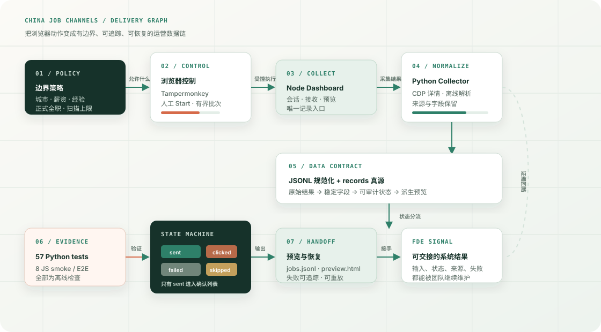

# China Job Channels · 脱敏工程说明

这是一个面向个人求职运营的本地数据工作台案例。它把浏览器采集、结果规范化、沟通状态和离线验证组织成一条有界链路，用来展示 FDE 在需求收敛、跨栈集成、状态建模和交接设计上的工程判断。

## 公开内容

- Node Dashboard：会话启动、记录接收和静态预览入口。
- Python collector：受控浏览器采集与离线解析边界。
- JSONL contract：稳定字段、来源和状态的规范化方式。
- Records truth source：把确认完成与尝试、失败、跳过分开。
- Verification：JavaScript smoke / E2E 与 Python 离线测试，共 57 个用例。

## 状态契约

| 状态 | 含义 | 是否进入确认列表 |
| --- | --- | --- |
| `sent` | 有明确平台回执或完成证据 | 是 |
| `clicked` | 发生点击或尝试，但没有完成证据 | 否 |
| `failed` | 页面、入口或传输失败 | 否 |
| `skipped_qualification` | 不满足预先定义的岗位边界 | 否 |

## 为什么不放原始源码

原始工程依赖第三方页面和用户登录态。为避免把会话、Cookie、账号、采集结果或运行配置带入公开仓库，这里只保留脱敏架构、状态契约、验证结果和案例入口。完整职责与取舍见 [作品集案例页](../../projects/china-job-channels.html)（GitHub Pages）以及 [脱敏能力卡](../../docs/china-job-channels-case.zh-CN.md)。

## 证据边界

- 57 个用例来自本机离线检查，不代表真实站点持续运行。
- 结构图是工程示意，不是线上生产截图。
- 任何真实账号、密码、Token、Cookie、职位记录和第三方页面数据都不在本目录。
