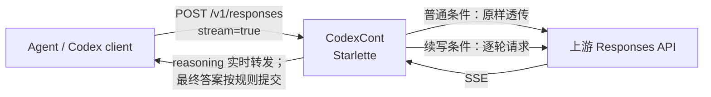
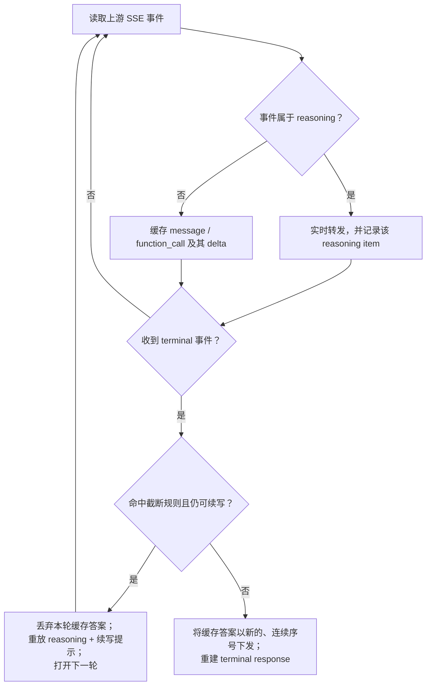

# CodexCont 学习指南：如何理解这个项目

> 本文基于当前源码编写，目的是帮助维护者理解现有行为，而不是提出新的实现方案。最后核对：2026-07-13。

> **逐文件扩展：** 阅读某个源码文件前后，可查阅[按代码文件学习索引](按代码文件学习/README.md)。它逐一解释本仓库每个自有 Python 文件的职责、控制流、状态与关键不变量。

> **覆盖边界（2026-07-14 核对）：** 总览的逐文件扩展还覆盖实际配置、配置模板、工程依赖声明和 Windows 启动/切换脚本；完整清单见[按代码文件学习索引](按代码文件学习/README.md)。第三方依赖（`.venv` 内 HTTPX、Starlette、Uvicorn 等）的内部源码不在本项目学习范围。

## 0. 逐文件学习资料入口（本总览的扩展）

按推荐阅读顺序打开：

1. [run.py](按代码文件学习/01-run.md) → [middleware/app.py](按代码文件学习/02-app.md) → [middleware/proxy.py](按代码文件学习/03-proxy.md)
2. [middleware/sse.py](按代码文件学习/04-sse.md) → [middleware/codex.py](按代码文件学习/05-codex.md) → [middleware/creds.py](按代码文件学习/06-creds.md) → [middleware/config.py](按代码文件学习/07-config.md) → [middleware/store.py](按代码文件学习/08-store.md) → [middleware/__init__.py](按代码文件学习/09-init.md)
3. [tests/test_middleware.py](按代码文件学习/10-test-middleware.md)
4. [config.toml（本机配置）](按代码文件学习/11-config-local.md) → [config.example.toml（模板）](按代码文件学习/12-config-example.md) → [pyproject.toml](按代码文件学习/13-pyproject.md)
5. [switch-upstream.ps1](按代码文件学习/14-switch-upstream.md) → [start-codexcont-ccswitch.bat](按代码文件学习/15-start-ccswitch.md) → [.gitignore](按代码文件学习/16-gitignore.md)

`uv.lock` 是由依赖解析生成的精确锁文件；其作用和边界在 [pyproject.toml 学习文件](按代码文件学习/13-pyproject.md) 中说明，但不逐条解析其机器生成依赖记录。README、许可证及本学习资料本身属于说明文件，不重复写“源码逻辑”扩展。

## 1. 一句话定义

**CodexCont 是运行在单个开发者本机上的流式 Responses API 代理。**

它对普通请求保持透明转发；只有在「流式 + 启用 reasoning + 开启续写」时，才会观察上游 SSE 流。如果该轮 reasoning 呈现已知的截断指纹，代理会丢弃这一轮尚未确认的最终回答、让模型继续 reasoning，并把多轮结果折叠成客户端看起来像一次响应的 SSE 流。

它的目标不是把每个请求都“增强”为无限思考，而是在特定、可识别的中断场景中做**保守自动续写**。

## 2. 先建立正确的心智模型

理解本项目最重要的一点是区分两类输出：

1. **已提交的 reasoning**：代理一收到便下游转发。它代表模型在本轮确实产生过的思考过程。
2. **暂定的非 reasoning 输出**：`message` 和 `function_call` 先缓冲，尚不转发。因为若本轮其实被推理截断，这些内容可能是仓促或不完整的答案。

因此，CodexCont 不是简单“拼接多个 SSE 响应”，而是在维护一个**提交边界**：

- 若本轮自然结束：缓冲的最终回答被提交、下发。
- 若本轮命中截断并可继续：缓冲回答被抛弃；reasoning 被带入下一轮。
- 若上游异常结束：不泄露尚未提交的最终回答；构造 `response.incomplete`。

这个提交边界解释了大部分看起来复杂的 SSE 重写代码。

## 3. 系统全貌



默认入口由 `run.py` 建立：读取 `config.toml`，创建 Starlette 应用并用 Uvicorn 监听。默认示例监听 `127.0.0.1:8787`，因此设计边界是 **Local Middleware**，不应把它当作共享网关或多租户服务。

## 4. 请求的两条路径

### 4.1 透明代理路径（大多数请求）

`middleware.app.handle_responses()` 会先校验请求体为 JSON 对象、解析上游 URL、检查凭据安全规则。然后在下列任一情形下走 `_passthrough()`：

- `[continue].enabled = false`；
- 请求不是流式（`stream` 不为真）；
- 请求显式关闭 reasoning；
- `method = "tool_pair"` 且客户端自己声明了同名 `continue_thinking` 工具，以避免工具名冲突。

透明代理仍会处理代理自身的控制头和凭据策略，但请求体与上游 SSE 主体不做“续写折叠”。

### 4.2 折叠／续写路径

只有同时满足以下条件才进入 `fold_stream()`：

```text
continue.enabled
AND request.stream
AND reasoning_enabled(request)
AND no tool-pair name collision
```

第一轮请求先由 `open_round()` 打开。如果上游立即返回 HTTP 4xx/5xx，代理直接把真实状态码与响应体返回，而不是包装成 HTTP 200 的 SSE。

## 5. 一轮 SSE 在代理中的生命周期

核心实现位于 `middleware/proxy.py:fold_stream()`。



实现细节：

- `middleware/sse.py:incremental_sse()` 能处理任意字节边界，逐步组装 SSE 事件；损坏 JSON 会被宽容跳过。
- `fold_stream()` 将 upstream 的输出项按 `output_index` 分类。reasoning 的事件即时下发；其他输出项放入 `out_buffer`。
- 最终下发时，代理会重新分配连续 `sequence_number` 和下游 `output_index`。必要时可将最终文本按 `rechunk_size` 重新切成小 delta，避免一次吐出完整大文本。
- `response.completed`、`response.failed` 与 `response.incomplete` 都被视为 terminal 事件。代理会重建最终 `response`，其 `output` 仅包含所有已下发的 reasoning 和最后真正提交的一轮非 reasoning 输出。
- `usage` 也会重算：多轮 reasoning 相加，最终非 reasoning 输出只计最终提交轮；同时在 `metadata.proxy_rounds` 中保存各轮统计和停止原因。

## 6. “何时续写”：一个保守且经验性的判断

`middleware/codex.py` 的核心规则是：

```text
reasoning_tokens == truncation_step × n - 2，且 n >= 1
```

示例默认 `truncation_step = 518`，因此 `516`、`1034`、`1552` 等会被识别为截断等级 `n`。是否真的继续还要经过：

- `min_n` / `max_n` 允许的等级范围；
- `max_continue` 允许的额外轮次数；
- `max_total_output_tokens`（若非 `0`）累计成本上限；
- 当前轮必须存在可重放的、带 `encrypted_content` 的 reasoning；
- 本轮必须正常收到 terminal 事件。

这不是 API 契约，而是对观察到的上游行为的**兼容性规则**。维护时的原则是：它失效时，宁可停止续写（漏续写），不要据不确定信号不断产生额外请求（误续写／失控成本）。

## 7. 如何构造下一轮请求

触发续写后，项目并不是让客户端额外发送请求，而是由代理内部构造下一轮 Responses 请求：

```text
原始 input
+ 本轮已产生的 reasoning（含 encrypted_content）
+ 一条“继续思考”的提示
```

构造逻辑在 `middleware/codex.py:build_round_payload()`；后续轮会移除 `previous_response_id`，以便使用显式重放的输入序列。

有两种续写提示策略：

| 方法 | 默认？ | 形式 | 适用理解 |
|---|---:|---|---|
| `commentary` | 是 | 插入一个 `phase: "commentary"` 的 assistant message，例如 `Continue thinking...` | 简洁、不引入工具调用；可选 `forward_marker` 将标记暴露给下游 |
| `tool_pair` | 否 | 合成 `continue_thinking` 的 function call 与 output | 兼容旧路径；需要避免与客户端声明的同名工具冲突 |

目前推荐优先理解和使用 `commentary`。`tool_pair` 还可通过 `repair_followup = "stateful"` 用 `IdStore` 在未来客户端请求中按已记录的 reasoning id 回插续写工具对；这是兼容策略，不是主路径。

## 8. 配置：先看哪些字段

配置结构定义在 `middleware/config.py`，示例见 `config.example.toml`。

### 服务与上游

- `[server] host / port / listen_paths`：监听范围与接受的 POST 路径。
- `[upstream] url`：默认上游 Responses endpoint。
- `[upstream] mode`：
  - `fixed`：永远使用配置 URL；
  - `header`：若有 `Responses-API-Base` 则使用它（自动补 `/responses`），否则回退配置 URL；
  - `header_required`：缺此头即返回 400。

### 凭据安全

`middleware/creds.py` 转发绝大多数客户端头，但移除 hop-by-hop／代理控制头（包括 `Responses-API-Base`）。鉴权可为：

- `passthrough`：不注入；
- `inject`：以本地配置覆盖；
- `passthrough_then_inject`：客户端未提供时才注入。

一个重要的防泄漏规则：当请求通过 `Responses-API-Base` 指定了上游地址，且该请求会需要代理注入 Authorization 时，应用拒绝请求。换言之，本地配置的凭据不会被发送到请求方指定的外部 URL。

### 续写与输出

- `[continue] enabled`：总开关。
- `truncation_step`、`min_n`、`max_n`：截断规则窗口。
- `max_continue`、`max_total_output_tokens`：主要成本与失控保护。
- `method`、`marker_text`、`forward_marker`：续写提示形式。
- `[stream] force_include_encrypted`：请求上游返回 reasoning 的 `encrypted_content`，这是重放 reasoning 的前提。
- `rechunk_final_answer`、`rechunk_size`：最终答案的下游 delta 重组方式。

注意：`middleware/config.py` 内的 dataclass 默认值与仓库中的 `config.toml`／`config.example.toml` 可不同。运行行为优先由实际 `config.toml` 决定；排查问题时必须同时检查这两处，而不要只读代码默认值。

## 9. 模块阅读顺序（建议照此学习）

1. `run.py`：程序如何启动、配置从哪里来。
2. `middleware/config.py`：先掌握所有可变行为和安全阈值。
3. `middleware/app.py`：判断请求走透明代理还是折叠路径，是系统的总闸门。
4. `middleware/sse.py`：理解“任意网络分块”如何还原成完整 SSE 事件。
5. `middleware/codex.py`：阅读截断数学、reasoning 检查和下一轮 payload 构造。
6. `middleware/proxy.py`：最后阅读最长的状态机；始终用“实时 reasoning / 暂定答案 / terminal 决策”三个概念来跟踪。
7. `middleware/creds.py` 与 `middleware/store.py`：理解凭据边界和旧 tool-pair 的跨请求修复。
8. `tests/test_middleware.py`：把测试当作可执行行为说明，而不是仅当作回归检查。

## 10. 测试如何证明行为

项目不依赖 pytest。离线测试脚本是：

```powershell
.\.venv\Scripts\python.exe tests\test_middleware.py
```

它使用 SSE fixture 和假上游客户端，覆盖：

- 截断数学及范围限制；
- SSE 任意分块下的解析一致性；
- 多轮折叠、序号重建、usage 重算和停止原因；
- 截断轮的 message 与 tool call 不泄露；
- `commentary` / `tool_pair` 两种续写载荷；
- 请求头透明性、上游 URL 解析、凭据注入和外部 URL 凭据保护；
- reasoning 开关、stateful repair、无 terminal EOF。

当前已实际执行该命令：**103/103 checks passed**。同时，Python 编译检查 `python -m compileall -q middleware run.py` 也已通过。

## 11. 排查问题时的决策树

### “为什么没有续写？”

依次确认：请求是否 `stream=true`、reasoning 是否启用、`continue.enabled` 是否真、token 是否匹配经验公式、等级是否处于 `min_n/max_n`、是否达到轮次/token 上限、reasoning 是否包含可重放的 `encrypted_content`。

### “为什么客户端没有看到这一轮答案？”

先判断这是否是预期：命中截断的那一轮，其 `message` / `function_call` 是暂定输出，会被丢弃。只有完成轮的非 reasoning 输出会被最终提交。

### “为什么请求被 400 拒绝？”

重点检查 `[upstream].mode = "header_required"` 是否缺 `Responses-API-Base`；或请求使用 header 覆盖上游但未携带自己的 Authorization，导致防泄漏规则生效。

### “为什么 usage 看起来和单轮上游不同？”

这是设计行为。对客户端的最终 usage 表示折叠后的结果：所有已经转发的 reasoning 加上最后提交答案的非 reasoning 部分；`metadata.proxy_rounds` 可用于回看每轮 token 数据。

## 12. 后续设计时不能破坏的约束

如果未来我们继续设计或改造项目，以下是现有架构最值得保护的约束：

1. **默认透明**：未满足严格条件的请求不应被改写。
2. **保守触发**：截断判断是可关闭的经验规则，不应演变为无条件循环。
3. **不泄露暂定输出**：未确认完成的 message 和 tool call 不能因错误路径被下发。
4. **凭据不越界**：请求方指定上游 URL 时，绝不能把本机配置凭据带过去。
5. **保持流式体验**：reasoning 应尽可能实时下发；最终答案可以缓冲但需以合法、连续的 SSE 事件重建。
6. **成本可观察、可限制**：轮数、累计 token、每轮 metadata 与停止原因要能让 Local Operator 诊断。

---

## 术语

- **Local Operator**：运行 CodexCont、控制本机配置与凭据的单个开发者。
- **Local Middleware**：仅运行在本机回环地址、处在 agent 与上游 Responses API 之间的 CodexCont 进程。
- **Conservative Continuation（保守自动续写）**：仅在识别到中断信号并满足所有上限时续写；不确定或失败时停止而不是重试。
- **暂定输出**：当前轮产生但尚未证明是最终结果的 message 或 function call。
- **提交边界**：决定暂定输出是被下发，还是因进入下一轮 reasoning 而被丢弃的时刻。

# 附录 A：源码级完整解析

> 本附录补足前文的概念性说明：它按文件、函数、状态变量和事件分支解释当前实现。阅读时可把本文与源码并排打开。

## A.1 项目文件清单与职责

| 路径 | 是否参与运行时 | 作用 | 学习优先级 |
|---|---:|---|---:|
| `run.py` | 是 | 读取本地配置、设置日志、启动 Uvicorn | 高 |
| `middleware/app.py` | 是 | HTTP 入口、上游路由选择、安全闸门、选择透传或折叠 | 最高 |
| `middleware/proxy.py` | 是 | 多轮 SSE 状态机、输出提交、usage/metadata 重建 | 最高 |
| `middleware/sse.py` | 是 | 将任意分块字节流解析为 SSE 事件，并重新序列化 | 高 |
| `middleware/codex.py` | 是 | 截断公式、续写提示、下一轮 request payload、跨轮修复 | 高 |
| `middleware/creds.py` | 是 | 上游请求头筛选和鉴权注入策略 | 高 |
| `middleware/config.py` | 是 | TOML → 冻结 dataclass 配置 | 中 |
| `middleware/store.py` | 仅 legacy stateful 路径 | reasoning id 的内存 LRU + TTL 记录 | 中 |
| `tests/test_middleware.py` | 否 | 不依赖 pytest 的离线行为测试与 fake upstream | 高 |
| `tests/fixtures/*.sse.txt` | 否 | 真实形状的 SSE 回放样本 | 中 |
| `config.example.toml` | 否 | 所有可配置行为的说明性样例 | 高 |
| `config.toml` | 是 | Local Operator 的本机实际配置；可能含敏感数据，不应提交或复制到文档 | 高 |
| `switch-upstream.ps1` | 辅助 | 切换 CodexCont 上游并把 Codex 指到本地代理 | 低 |
| `start-codexcont-ccswitch.bat` | 辅助 | 检查本地 CCswitch/Cockpit 后调用切换脚本 | 低 |
| `INSTALL-GUIDE-AGENT/AGENT.md` | 否 | 面向安装代理的受控安装 runbook | 低 |

`middleware/__init__.py` 仅有包说明，不含业务逻辑。

## A.2 启动、对象生命周期与路由

### `run.py`

执行路径非常短：

```python
cfg = load_config(ROOT / "config.toml")
logging.basicConfig(... cfg.log.level ...)
app = create_app(cfg)
uvicorn.run(app, host=cfg.server.host, port=cfg.server.port, ...)
```

所以进程启动时配置只读取一次。修改 `config.toml` 后需要重启服务才能生效；代码没有热重载或配置文件监控。

### `create_app(cfg)` in `middleware/app.py`

Starlette 的 lifespan 做三件事：

1. 将 `cfg` 保存为 `app.state.cfg`；
2. 创建一个共享的 `httpx.AsyncClient` 并保存为 `app.state.client`；
3. 创建一个 `IdStore` 并保存为 `app.state.id_store`；进程结束时关闭 HTTP client。

`cfg.server.listen_paths` 中的每一个路径都会注册为只接受 `POST` 的 `handle_responses`。这不是通用反向代理：未列出的 URL、非 POST、其他 API 都不会被处理。

### `_make_client()` 的细节

HTTP client 使用 `timeout=None`，意味着本代理层不会主动超时中断上游。它又删除 httpx 默认的 `User-Agent` 与 `Accept`，以兑现“代理不发明这些 agent 头”的设计。`Host`、`Content-Length`、`Accept-Encoding`、`Connection` 则由 HTTP client 自己管理。

## A.3 `handle_responses()`：总入口逐步执行

下面按照实际顺序解释，而不是按功能分类：

1. **读取全部入站 body**：`raw = await request.body()`。这意味着请求 body 本身不是流式上传；SSE 是响应方向的流。
2. **JSON 验证**：非法 JSON 或 JSON 顶层不是对象都返回 HTTP 400。此时不会请求上游。
3. **选择上游 URL**：调用 `_resolve_upstream_url()`。
4. **防凭据泄漏**：若 URL 是由 `Responses-API-Base` 头提供，并且当前 auth 策略会使用配置中的 Authorization，则拒绝请求。理由是用户可控的 URL 不能获得 Local Operator 的本地 token。
5. **检测工具名冲突**：仅在 `method == "tool_pair"` 时，检查 `body.tools` 是否声明了代理要注入的 `continue_thinking` 名称。若冲突，走透传，不触碰该请求。
6. **计算 `should_fold`**：必须是启用续写、`stream` 真、`reasoning` 没有显式设为 `false`、且无上述冲突。
7. **透传分支**：不满足条件时，`_passthrough()` 将原始 `raw` body 交给 `open_passthrough()`；响应字节通过 `StreamingResponse` 原样逐块返回。
8. **折叠分支的可选历史修复**：当 `repair_followup="stateful"` 且使用 `tool_pair`，用 `repair_followup_input()` 修补来自客户端的后续 `input`。
9. **建第一轮 payload**：`build_round_payload()` 强制上游流式、按需要加上 `reasoning.encrypted_content`，但第一轮保留客户端传入的 `previous_response_id`。
10. **提前打开第一轮**：若上游直接返回 `>= 400`，真实错误 body、状态码和 content type 直接返回；若 2xx，才用 `fold_stream()` 作为下游响应体。

这个“首轮先开、后续轮在生成器内开”的结构很重要：首轮错误还能是普通 HTTP 错误，客户端一旦已收到成功的流响应，后续轮错误只能表示为 SSE 内的 `response.incomplete`。

## A.4 上游 URL 的精确规则

`_header_base()` 读取请求头 `Responses-API-Base`（大小写不敏感）并去除首尾空白。`_join_responses()` 先去掉末尾 `/`，再保证 URL 以 `/responses` 结束。

`_resolve_upstream_url()` 的真值表：

| `[upstream].mode` | 有非空 `Responses-API-Base` | 无此头 / 空白头 |
|---|---|---|
| `fixed` | 使用 `cfg.upstream.url`，忽略头 | 使用 `cfg.upstream.url` |
| `header` | 使用头值构成的 endpoint | 回退 `cfg.upstream.url` |
| `header_required` | 使用头值构成的 endpoint | 返回 `None`，入口返回 400 |

只有第二、三行且头非空时，`_url_is_from_header()` 才为真，从而触发防泄漏保护。

## A.5 `config.py`：配置不是业务状态

所有配置项均是 `frozen=True` 的 dataclass；运行中不应改变它们。`load_config()` 的处理规则：

- `config.toml` 不存在时使用代码默认值；
- section 若不是 TOML table，抛出 `ValueError`；
- 不认识的字段被 `_only_known()` 忽略，而非报错；
- `server.listen_paths` 的 TOML list 被转换为 tuple；
- `[upstream.headers]` 作为嵌套 table 单独抽出并统一转为字符串。

这意味着拼错配置键可能被静默忽略。排查“配置不生效”时，先核对拼写与 `config.py` dataclass 的字段名。

## A.6 `creds.py`：请求头的逐步转换

`build_upstream_headers(agent_headers, cfg)` 不是白名单转发，而是“基本透传 + 少量剔除”：

1. 复制客户端每个 header；
2. 删除 HTTP client 必须自己拥有的 `host`、`content-length`、`connection`、`keep-alive`、`proxy-connection`、`transfer-encoding`、`accept-encoding`；
3. 删除只供本代理消费的 `responses-api-base`；
4. 按 auth mode 处理 `Authorization` 与 `chatgpt-account-id`；
5. 最后应用 `[upstream.headers]`，它能以大小写不敏感方式覆盖之前任何同名 header。

鉴权的决策函数 `_should_inject(mode, header_present)`：

| mode | 客户端已带 header | 客户端未带 header |
|---|---|---|
| `passthrough` | 保留客户端值 | 不加 |
| `inject` | 配置值覆盖客户端值 | 加配置值 |
| `passthrough_then_inject` | 保留客户端值 | 加配置值 |

`would_inject_authorization()` 只有在配置 token 非空且策略实际会注入时才为真。入口用它做 URL override 安全判断，因此“配置 token 为空”时不会因该规则拦截请求。

## A.7 `sse.py`：为什么它能处理网络任意分块

上游 `aiter_bytes()` 不保证一次 chunk 等于一个 SSE event。`incremental_sse()` 因此维护两个局部状态：

- `buffer: bytes`：尚未包含换行符的残余字节；
- `data_lines: list[str]`：当前 SSE event 中的所有 `data:` 行。

算法：每个 chunk 追加到 `buffer`；只要有 `\n` 就取出一行，去除 `\r`；空行表示 event 结束，拼接多条 `data:` 行后解析 JSON。`data: [DONE]` 用独立字符串 sentinel `DONE` 表示；JSON 无法解析的 event 被跳过；上游 EOF 时仍会尝试 flush 未以空行收尾的 event。

`serialize_event()` 反向生成：

```text
event: <event.type>
data: <紧凑 JSON>


```

`serialize_done()` 只生成 `data: [DONE]\n\n`。代理不保留上游的 `event:`、`id:`、`retry:` 行，原因是下游以 JSON 内部的 `type` 为准并且会重写事件内容。

## A.8 `codex.py`：所有“继续”的纯函数

### 截断函数

- `is_truncation_pattern(tokens, step)`：token 非空、至少 `step - 2`，且 `(tokens + 2) % step == 0`。
- `tier_n()`：命中时返回 `(tokens + 2) // step`；否则 `None`。
- `should_continue()`：在命中前提下再应用 `min_n` 与 `max_n`；`max_n = 0` 表示无等级上限。
- `reasoning_tokens(usage)`：从 `usage.output_tokens_details.reasoning_tokens` 读值并转为 int。

这些函数不请求网络也不改状态，所以是最容易、最应该优先修改测试覆盖的区域。

### 续写提示函数

- `commentary_message(text)` 返回一个 assistant `message`，有一个 `output_text` content 和 `phase: "commentary"`。
- `continue_call_id(reasoning_id)` 对 reasoning id 取 SHA-1 后截断 24 位，得到稳定 `call_...`。相同 id 一定得到相同调用 id，服务于幂等修复和 prompt-cache 稳定性。
- `continue_pair()` 用上述 id 返回 function call（`{"continue": true}`）与其 output。它是输入历史中的合成项，不是往 `tools` 声明中注册的真实工具。

### payload 函数

`merge_include()` 只接受 list 类型的原始 `include`，然后按需追加 `reasoning.encrypted_content`。`build_round_payload()` 浅复制原始 body，**仅**做以下改写：强制 `stream=True`、替换 `input`、合并 `include`、后续轮移除 `previous_response_id`。它刻意不发明 model、instructions、reasoning 或 tools。

`reasoning_enabled(body)` 采用“默认开启”语义：只有 JSON 值严格为布尔 `false` 才关闭；缺失、`null`、空对象和普通 reasoning 配置对象都进入折叠候选范围。

`repair_followup_input()` 遍历输入。对每个 type 为 `reasoning` 且 id 位于 `IdStore` 的项，在它**之后**插入确定性的 function call/output；若下一项已经是相同 call id，则跳过，保证重复执行不会重复插入。它绝不通过“相邻的 reasoning”猜测插入位置，以免破坏自然连续的 reasoning 项。

## A.9 `proxy.py` 前半：低层工具函数

| 函数 / 类 | 输入到输出 | 关键点 |
|---|---|---|
| `open_round` | 结构化 payload → 流式 `httpx.Response` | JSON 先自行编码并使用 `content=`，不让 httpx 自动添加 Content-Type |
| `open_passthrough` | 原始请求 bytes → 流式 response | body 不改写 |
| `_tee` | 异步 bytes iterator → 同样 iterator | 同时写每轮 SSE dump；仅当 `dump_rounds_dir` 非空使用 |
| `_sum_usage` | 多轮 usage → 累计 usage | 累加 input/output/total、cached、reasoning |
| `_Seq` | 无参调用 → 递增整数 | 所有下游事件共享一个连续 `sequence_number` |
| `_find_buffer` | upstream output index → 缓冲项 | 通过原始 `output_index` 找暂定 item |
| `_flush_entry` | 缓冲 message/function call → 下游 SSE bytes | 重写 index/序号；message 可重新切片文本 delta |
| `_commentary_events` | 已完成 commentary message → 一组标准 SSE 事件 | `forward_marker=true` 时使用 |
| `_agent_usage` | 首轮、累计、最终轮 usage → 下游 usage | 客户端看到的 usage 与真实累计 billed usage 分开 |
| `_with_proxy_metadata` | response + round info → response | 写入 `metadata.proxy_rounds`、停止原因与累计账单 usage |
| `_reconstruct_terminal` | terminal + 已提交 output → 完整 terminal event | 用折叠后的 response 替换上游最后一轮 response |
| `_synthetic_incomplete` | 当前状态 + 失败原因 → terminal event | 在 EOF/网络错误/后续轮错误时保证响应仍然合法结束 |

### `_flush_entry()` 的 re-chunk 行为

当 `stream.rechunk_final_answer=true` 且 item 类型为 `message`：

1. 收集缓冲事件里所有 `response.output_text.delta` 的 `delta`；
2. 把它们拼成完整文本；
3. 保留开始与结束生命周期事件，但将原始 delta 串替换为固定 `rechunk_size` 的小 delta；
4. 重写每个事件的 `output_index` 与 `sequence_number`。

function call 不重切，按原始缓冲事件顺序下发。这样客户端接收到的消息仍是流式协议，但不会因为代理长时间缓冲而只收到一个过大的文本块。

## A.10 `fold_stream()`：逐行状态机的变量表

函数参数含义：`first_response` 是已打开且确认 2xx 的首轮；`client/url/headers` 用于开后续轮；`base_body` 是第一轮的有效原始请求；`id_store` 仅供 stateful tool-pair 使用。

### 跨所有轮保存的状态

| 变量 | 含义 | 最终用途 |
|---|---|---|
| `seq` | `_Seq` 实例 | 每一条下游 SSE 事件的顺序号 |
| `ds_oi` | 下游下一个 output index | 隐藏被丢弃轮后仍保持连续 |
| `base_response` | 首次 `response.created.response` | 构造最终 response 的基础 id/属性 |
| `saw_done` | 是否见过上游 `[DONE]` | 最后是否发送下游 `[DONE]` |
| `final_output` | 已真实下发的 reasoning + 最终提交项 | 重建 terminal response 的 `output` |
| `total_usage` | 每轮 usage 累加 | 诊断性 `proxy_billed_usage` 与总上限 |
| `first_usage` | 第一轮 usage | 客户端 input/cache 用首轮，而不是多轮重放总和 |
| `replay_tail` | 每次续写产生的 reasoning + marker 累积 | 后续 round 的显式 input 尾部 |
| `rounds_info` | 每轮号、reasoning tokens、tier | metadata 与排障 |
| `response` | 当前轮 HTTP response | 每次续写后替换 |
| `round_no` | 当前第几轮 | 轮数限制、日志、dump 文件名 |

### 每轮重新初始化的状态

| 变量 | 含义 |
|---|---|
| `oi_map` | 上游 reasoning `output_index` → 代理分配的下游 index |
| `item_kind` | 某 upstream index 是 `reasoning` 还是 `buffered` |
| `out_buffer` | 本轮暂定 message/function call 的完整事件序列 |
| `round_reasoning` | 在本轮完成的 reasoning item，用于重放 |
| `terminal` | 首个 `response.completed/failed/incomplete` 事件 |
| `usage` | 从 terminal response 中取出的本轮 usage |

### 事件处理的精确分支

1. `DONE`：不立即结束，只将 `saw_done=True`，因为真正的 terminal response event 才决定成功／失败／续写。
2. 非 dict：忽略。
3. `response.created` 或 `response.in_progress`：只把**第一轮**的这两个事件下发。第 2+ 轮生命周期事件被吞掉，令客户端始终看到一条 response。
4. terminal：保存为 `terminal`，记录 usage，跳出当前 round 的事件循环。
5. `response.output_item.added`：
   - item.type 为 `reasoning`：标记类别、映射 index、立刻改序号并下发；下游 index 加一。
   - 其他 item：标记 buffered，创建 `{oi, itype, events, item}` 缓冲项，但不下发。
6. 与已知 reasoning index 对应的事件：若是 `output_item.done`，把完成 item 加入 `round_reasoning` 和 `final_output`；然后立即下发。
7. 与 buffered index 对应的事件：只追加到该缓存；若是 done，则用 done event 的 `item` 更新缓存项。
8. 不属于上述任何 tracked item 的 item-scoped event：作为 best-effort 事件下发，只重写 sequence number。

关键后果：即使本轮最终被抛弃，reasoning 早已发给客户端；而 message/function call 从 `added` 到所有 delta/done 都没有泄露。

## A.11 一轮结束后的判定公式

事件循环结束后，函数：

1. `saw_terminal = terminal is not None`；
2. 把该轮 `usage` 加进 `total_usage`，首轮另存 `first_usage`；
3. 读 `rt = reasoning_tokens(usage)`，计算 `n = tier_n(rt, truncation_step)`，写入 `rounds_info`；
4. `has_enc` 只看本轮最后一个 completed reasoning item 是否有 `encrypted_content`；
5. `within_caps` 表示累计 `output_tokens` 尚未达到 `max_total_output_tokens`（0 表示不限）；
6. 计算：

```python
do_continue = (
    cont.enabled
    and saw_terminal
    and should_continue(rt, min_n=..., max_n=..., step=...)
    and has_enc
    and round_no <= cont.max_continue
    and within_caps
)
```

`round_no <= max_continue` 是一个容易误读的细节：`round_no=1` 时允许开启第 2 轮；因此 `max_continue` 实际代表“允许触发继续的原始轮数上限／额外轮的 guard”，不要只凭字段注释臆测其边界，应以测试与实际轮次日志确认。

如果 token 匹配截断模式但没有继续，`stopped_reason` 会分为：`no_encrypted_content`、`max_continue`、`max_total_output_tokens`、`tier_out_of_window`。若根本没收到 terminal，则最终原因为 `upstream_eof`。

## A.12 继续、正常结束、异常结束：三条收尾路径

### 路径 1：`do_continue == true`

- 获取本轮最后一个 reasoning id；
- `commentary`：生成一条 commentary marker；`tool_pair`：可选把 id 记录进 `IdStore`，再生成 call/output；
- 将 `round_reasoning + marker_items` 追加到 `replay_tail`；
- 若 commentary 的 `forward_marker=true`，把一个合成但安全的 completed message 立即下发并加入 `final_output`；tool pair 从不下发；
- 下一轮 payload 的 input 为 `orig_input + replay_tail`；移除 `previous_response_id`；
- 打开下一轮。若它返回 HTTP error，则产生合成 `response.incomplete(reason=upstream_error)`，不尝试继续重试。

### 路径 2：有 terminal 且不继续

这是自然完成、上游 failed/incomplete，或某个守卫停止后的统一出口：

- 对 `out_buffer` 每项调用 `_flush_entry()`，此时暂定输出才真正到达客户端；
- 每个提交项加入 `final_output`；
- `_reconstruct_terminal()` 使用首轮 response identity、最终 output、折叠 usage 和 proxy metadata 构造一个新的 terminal SSE event；
- 只有见过上游 `[DONE]` 时才补发下游 `[DONE]`。

注意：上游 `response.failed` / `response.incomplete` 也会走这个“有 terminal”出口；代码保留它的 status/type，同时提交已经缓冲的本轮非 reasoning 输出。这是当前实现行为，修改失败语义前应先补测试并明确产品期望。

### 路径 3：无 terminal EOF 或抛出网络异常

- **无 terminal EOF**：绝不 flush `out_buffer`；只保留已实时转发的 reasoning；生成 `response.incomplete`，原因 `upstream_eof`。
- **HTTP/连接异常**：捕获 `httpx.HTTPError` / `ConnectionError`，生成同类 incomplete，原因 `upstream_error`。
- 无论走哪条路径，`finally` 均尝试关闭当前 response。

## A.13 usage 与 metadata：为什么有两套数字

代理把“客户端理解的一次 response”和“代理实际对上游产生的多轮账单”分开：

- `total_usage`：所有 round 的 input/output/cached/reasoning 简单累加。它在 metadata 中作为 `proxy_billed_usage`，适合成本审计。
- `_agent_usage(...)`：下游 terminal 的主 `usage`。输入／缓存值采用第一轮，reasoning 采用所有实际已转发 reasoning 的总和，非 reasoning output 只计算最终被 flush 的那一轮；再重算 `total_tokens`。
- `metadata.proxy_rounds`：每轮 `{round, reasoning_tokens, n}`。
- metadata 中还会放停止原因。这样 client 既能把它视作一条逻辑响应，又能在需要时看见折叠事实。

读日志时，`round N: in=... cached=... out=... reason=... -> <decision>` 是每轮判定；最终 `done: N round(s)` 是总览。

## A.14 `store.py`：为什么只在 legacy 模式才重要

`IdStore` 是单进程内存 `OrderedDict[reasoning_id, expiry]`：

- `add()` 写入 `time.monotonic() + ttl`，移动到末尾，然后从最旧端删除过期项并执行 maxsize LRU 淘汰；
- `key in store` 会检查 expiry，过期即删除，命中则移动到末尾；
- 它不持久化、没有多进程共享、重启即丢失。

所以 `repair_followup="stateful"` 只能增强同一个 CodexCont 进程内后续请求的 tool-pair 历史一致性。默认 `commentary` 路径不依赖它。

## A.15 测试文件：每组测试在保护什么

`tests/test_middleware.py` 自己实现 `check()`、`_RESULTS` 和 `main()`；它不是 pytest 测试文件，直接执行即可。`FakeResp` 和 `FakeClient` 让流式逻辑可以离线复现，不会访问真实 API。

| 测试函数 | 保护的行为 |
|---|---|
| `test_truncation_math` | 指纹、tier 和 min/max 边界 |
| `test_sse_framing` | fixture 被任意 chunk 大小切开时仍解析出同样事件 |
| `test_fold_real_captures` | 两轮真实样式 SSE 的折叠、序号、output、usage、round metadata、max_continue |
| `test_truncated_tool_call_discarded` | 被续写轮的 function call 与参数不会泄露 |
| `test_commentary_continuation_payload` | 默认 marker payload、encrypted reasoning 重放、默认不下发 marker |
| `test_tool_pair_continuation_payload` | legacy call/output 被正确注入且不混入 commentary |
| `test_forward_marker_emits_downstream` | commentary marker 下发时的 delta、output、序号 |
| `test_header_transparency` | client headers 保留／client-owned headers 删除 |
| `test_upstream_url_resolution` | 三种 upstream mode 与 URL 拼接 |
| `test_auth_safety_guard` | header override 不会拿到本地注入 token |
| `test_auth_injection` | 三种 auth mode 与 account id 行为 |
| `test_reasoning_gate` | 只有显式 `reasoning: false` 关闭折叠候选 |
| `test_stateful_repair` | 按 recorded id 插入、幂等、未记录不插入 |
| `test_eof_incomplete` | 无 terminal 时不泄露缓冲 message，只返回 reasoning + incomplete |

当前 103 个断言全通过，说明这些“已明确写下”的行为是可靠的回归基线；但它们没有覆盖真实网络、真实认证、并发负载、所有 Responses event 类型或上游协议变化。

## A.16 支持脚本的运行关系

`switch-upstream.ps1` 属于本机开发便利脚本，不是 Python 代理链路的一部分。它会：根据 preset / 输入 URL 规范成 `/responses` endpoint、更新项目 `config.toml` 的 `[upstream]`、将用户 Codex 配置中当前 provider 的 `base_url` 改为本地代理、尝试结束已监听 8787 的进程并后台启动新的 `run.py`，日志写入 `logs/`。

`start-codexcont-ccswitch.bat` 是它的快捷入口：先检查本机 56245 端口是否监听，再调用 `switch-upstream.ps1 ccswitch`，最后打印期望链路。它含有本机绝对路径和对 CCswitch/Cockpit 的假设，因此不应被当作跨机器通用启动方式。

## A.17 一次完整示例：两轮截断再完成

假设请求开启 stream/reasoning，第一轮上游产生：

```text
created → in_progress → reasoning R1 → message "半截答案" → completed
usage.reasoning_tokens = 516
```

执行过程：

1. created 与 in_progress 作为逻辑 response 的生命周期下发；
2. R1 的 added/delta/done 立刻下发，R1 加进 `round_reasoning` 与 `final_output`；
3. message 的所有事件只存在 `out_buffer`；
4. 516 命中 `518 × 1 - 2`，且 R1 有 encrypted content、未触顶上限；
5. 丢弃 `out_buffer`；下一轮 input = 原 input + R1 + commentary marker；
6. 第二轮的 created/in_progress 被吞掉，reasoning R2 仍实时下发；
7. 第二轮产生 message "完整答案"，其事件先缓冲；假设 usage 不再命中模式；
8. flush 第二轮 message（可重新切成小 delta）；将 R2 和该 message 置入最终 response.output；
9. 发送重构过的 `response.completed`，其中 metadata 说明两轮与停止原因 `natural`；若上游出现过 `[DONE]`，最后发送一个 `[DONE]`。

客户端从始至终看到的是**一个** response：其中有 R1、R2 和最终完整答案；看不到“半截答案”，也看不到用于诱导续写的内部 marker（默认配置）。

## A.18 维护这份项目时的最小修改策略

- 改判定阈值：先扩充 `test_truncation_math`，再改 `codex.py`；不要先修改 `proxy.py`。
- 改 SSE 行为：先构造 fixture 或 FakeResp 事件序列，再测试 `fold_stream` 的可观察下游事件；不要只断言内部变量。
- 改凭据／URL：同时更新 URL resolution、auth safety、header transparency 三组测试。这里的错误可能导致凭据泄漏。
- 改终态处理：覆盖 completed、failed、incomplete、无 terminal EOF、后续轮 HTTP error；保持“未提交输出不泄露”的不变量。
- 新增配置：更新 `Config` dataclass、`load_config` 行为、`config.example.toml` 和对应测试；注意未知键当前会被静默忽略。

这就是全项目的运行逻辑：`app.py` 决定是否介入，`creds.py` 确定安全边界，`codex.py` 决定能否与如何续写，`sse.py` 维护流边界，`proxy.py` 实现“只有最终答案才能提交”的多轮状态机。

# 附录 B：学习闭环——从“看懂文档”到“能独立维护”

前文完成的是**静态理解闭环**：不打开其他源码，也可以知道每个模块负责什么、一次请求怎样流动、哪些状态会变化，以及每种结束条件为何产生对应结果。

但“学会这个项目”不能只等于读完说明。真正的学习闭环还必须完成：**验证 → 追踪 → 解释 → 修改一个受控行为 → 回归验证**。本附录给出不依赖真实 API 凭据的最小闭环。

## B.1 学会的验收标准

当你可以独立完成下面六项，就可以说已经掌握 CodexCont 的当前实现：

1. 不看源码，说清楚何时走透明代理、何时进入折叠路径。
2. 给出一轮 SSE 的 `reasoning → message → completed` 事件，说明哪些事件即时下发、哪些被缓冲。
3. 给出 `reasoning_tokens=516`、有 `encrypted_content`、`max_continue=3` 的场景，说明为什么会开下一轮，以及下一轮 input 由什么组成。
4. 给出“上游没有 terminal event 就断开”的场景，说明为什么不能把 message 发给客户端。
5. 说明 `Responses-API-Base` 与 `auth.inject` 同时出现时为何可能被 400 拦截。
6. 改动一个低风险配置或纯函数后，能选择正确的测试并用离线测试证明没有回归。

如果其中任意一项答不出来，不要直接进入功能设计；先回到本文对应章节和源码。

## B.2 90 分钟推荐学习路线

### 第 1 段：建立全局模型（15 分钟）

阅读本文第 1～6 节，并画出下面这条线：

```text
客户端 request
  → app.py 安全检查与分流
  →（透传）原 body / 原 SSE
  或 →（折叠）第一轮 SSE → 判定 → 0..N 个后续轮 → 一个下游 SSE
```

**自测题**：为什么第一轮的 HTTP 4xx 可以原样返回，而第二轮 HTTP 4xx 只能变成 SSE 内的 incomplete？

**答案要点**：第一轮在 `StreamingResponse` 建立前打开；后续轮发生时 HTTP 200 流已向客户端开始发送，已无法改变 HTTP status。

### 第 2 段：先跑“可执行说明书”（10 分钟）

在项目根目录执行：

```powershell
.\.venv\Scripts\python.exe tests\test_middleware.py
```

不要只看最后的 `103/103`。按输出顺序把 PASS 分成：截断数学、SSE framing、fold、marker、headers、URL/auth、stateful repair、EOF。随后在 `tests/test_middleware.py` 找到对应的 `test_*` 函数。

**目标**：你应能把一个 PASS 名称指回“项目在保护什么用户可见行为”。

### 第 3 段：追踪一轮而不是读完全部 `proxy.py`（20 分钟）

打开 `tests/test_middleware.py` 的 `test_eof_incomplete()`，再打开 `middleware/proxy.py` 的 `fold_stream()`。

按该测试的事件列表模拟：

1. `response.created`；
2. `response.in_progress`；
3. reasoning 的 added 和 done；
4. message 的 added、delta、done；
5. EOF（没有 terminal）。

在纸上写出以下变量的最终值：`final_output`、`out_buffer`、`round_reasoning`、`terminal`、`saw_terminal`。然后对照代码解释最终为什么调用 `_synthetic_incomplete()`，以及为何 message delta 不会出现。

**这是理解本项目最关键的一道练习。**做通它，就理解了“暂定输出”和提交边界。

### 第 4 段：追踪两轮续写（20 分钟）

阅读 `test_fold_real_captures()` 与两个 fixture。只跟踪五件事：

- `round_no`；
- 本轮 `reasoning_tokens` 与 `tier_n`；
- `round_reasoning`；
- `replay_tail`；
- `final_output`。

当第一轮匹配 518n-2 指纹时，自己写出第二轮 input 的伪 JSON：

```text
[
  ...orig_input,
  ...第一轮已完成 reasoning,
  {type: message, role: assistant, phase: commentary, ...}
]
```

然后解释为什么被截断轮的 message / function call 不在这个 input 里，也不在最终下游 response.output 里。

### 第 5 段：理解安全边界（10 分钟）

阅读 `test_upstream_url_resolution()`、`test_auth_safety_guard()`、`test_auth_injection()`，并对照 `app.py` 与 `creds.py`。手工填写这张表：

| upstream mode | 请求是否给 Responses-API-Base | auth 策略会注入配置 token | 结果 |
|---|---:|---:|---|
| fixed | 是 | 是 | 使用配置 URL，允许 |
| header | 是 | 是 | 400，防止泄漏 |
| header | 是 | 否（客户端自带 Authorization 或纯 passthrough） | 允许，使用 header URL |
| header_required | 否 | 任意 | 400，缺少必需 header |

**目标**：知道此项目最敏感的改动区是 URL 与 auth 交叉逻辑，而不是 SSE 格式。

### 第 6 段：做一个可逆的学习实验（15 分钟）

只改本机 `config.toml` 中一个不含凭据的数值，例如临时设：

```toml
[continue]
enabled = false
```

启动本地服务后，用一个你明确授权的客户端发起请求，确认日志出现 `passthrough (disabled)`。随后恢复原值并重启。

如果没有可安全调用的真实上游，不要伪造或填入 token；前五段的离线测试已经足够完成代码学习闭环。

## B.3 不依赖真实上游的代码阅读实验

下面三项实验只动测试或临时副本，完成后还原；不要把“练习改动”混进功能提交。

### 实验 1：验证 SSE 分块无关性

在 `test_sse_framing()` 的 chunk size 列表新增一个极小值，例如 `1`。运行测试，理解为何逐字节分割仍应得到相同事件序列。恢复改动。

**学到的约束**：不能把 HTTP chunk 当作 SSE event。

### 实验 2：验证续写窗口

在 `test_truncation_math()` 增加一个断言：`max_n=1` 时 `1034` 不应继续。运行测试。然后查看 `should_continue()` 为什么无需改动。

**学到的约束**：截断数学是纯函数，策略窗口和流状态机相互隔离。

### 实验 3：验证“缓冲而不泄漏”

仿照 `test_eof_incomplete()`，让 message 包含一个醒目的文本，例如 `MUST_NOT_LEAK`。断言下游 SSE 字节／事件中不存在这个字符串。

**学到的约束**：错误路径也必须维护提交边界；不能只测成功响应。

## B.4 故障定位闭环

遇到真实问题时，按下面顺序收集证据。不要先改 token 阈值或重写 `proxy.py`。

1. **确认请求有没有进入本进程**：看 Uvicorn/应用日志和请求路径是否在 `listen_paths`。
2. **确认分流结果**：找 `passthrough (...)` 或 `fold start` 日志。
3. **若进入 fold**：找每轮 `round N: ... -> decision` 日志；它直接给出 tokens、tier、缓冲项和停止决策。
4. **需要协议证据时**：临时配置 `[log].dump_rounds_dir` 到本机安全目录，取得每轮原始 SSE；完成排查后清除或保护该目录，因为其内容可能含 prompt、回答或 reasoning。
5. **先写失败 fixture**：将必要的事件脱敏后做成 tests fixture 或 FakeResp 事件，令问题可离线复现。
6. **只改最靠近原因的模块**：数学问题改 `codex.py`，SSE framing 改 `sse.py`，提交状态机问题改 `proxy.py`，URL/auth 问题改 `app.py` 或 `creds.py`。
7. **运行全部离线测试**，并特别运行覆盖该故障的新增断言。

这条路径形成“日志证据 → 最小复现 → 最小修复 → 回归测试”的工程闭环。

## B.5 看完本文后仍不应该声称已经掌握的范围

本文足以学习**此仓库当前的代码与设计意图**，但它不会自动让读者掌握以下外部系统：

- OpenAI Responses API 的全部字段与未来协议变更；
- Codex / 其他 agent 客户端对 reasoning、phase、tool history 的真实兼容性；
- 真实网络故障、代理、TLS、并发压力和生产服务运维；
- 上游平台的计费规则与服务条款。

这些属于项目边界外的事实，必须以当前官方文档、受控的端到端测试和实际日志验证，不能从本仓库代码推断。

## B.6 结论：怎样才算“只看这一份文件就够”

- **要理解项目代码**：够。本文已给出入口、每个模块、关键函数、状态机、异常分支、配置、安全、测试和辅助脚本的完整解释；可把它当作源码导读。
- **要亲手维护项目**：阅读本文后，至少完成 B.2 的离线测试和两项 B.3 实验；否则只是“知道”，还没有验证自己能追踪行为。
- **要安全连接真实上游**：本文不替代安装 runbook 与实际凭据／服务配置审查；必须遵循 `INSTALL-GUIDE-AGENT/AGENT.md` 的受控流程，并在不泄露凭据的前提下验证。

# 附录 C：这份学习文件为谁写，以及完成后的能力边界

## C.1 目标读者

本文面向下述 Local Operator：

- 已经会基础 Python，例如变量、函数、字典、列表、导入模块；
- 没有或很少有 `async` / `await`、异步迭代器、HTTP 流式响应、SSE 的经验；
- 不熟悉 OpenAI Responses 风格的 request / response 结构；
- 希望理解并安全使用本机 CodexCont，而不是一开始就重构它。

因此阅读本文时，遇到异步、SSE 或 Responses 概念不应被当作默认已知前提。后续章节会以本项目的调用点解释它们，而不是脱离项目讲抽象定义。

## C.2 第一阶段的学习目标

完成本文和附录 B 的练习后，读者应能：

1. 在 Windows 本机按已有配置启动 CodexCont，并知道它监听的地址和请求路径；
2. 分辨 CodexCont、客户端、上游 Responses API 三者各自负责什么；
3. 看日志判断某次请求为何是 `passthrough`、为何进入 `fold start`、以及每轮为什么 `continue` 或停止；
4. 安全调整不含凭据的续写配置（例如 `enabled`、`max_continue`、`min_n`、`max_n`），知道改配置后要重启；
5. 在不连接真实上游的情况下运行离线测试，验证自己的理解和小改动；
6. 知道凭据与 `Responses-API-Base` 是安全边界，遇到问题先收集日志和最小复现，而不是盲改认证或上游 URL。

这是一份“理解、运行、观察、做低风险配置调整”的入门目标。**它不要求读者现在就能独立设计新的续写算法、重写 SSE 状态机，或在未知上游上运行高风险实验。**那些是后续维护阶段的目标。

## C.3 采用的教学方法：概念必须落到本项目的执行证据

本学习文件不采用“先讲完一套抽象理论、最后才看项目”的方式，而采用循环式学习：

```text
一个项目问题
  → 解释最少必要概念
  → 在对应源码中定位函数
  → 用真实输入／事件演算变量变化
  → 完成一个可验证的小练习
  → 回到完整请求链路
```

对应关系如下：

| 要学的概念 | 不脱离项目的入口 | 应观察的结果 |
|---|---|---|
| `async` / `await` | `handle_responses()` 调用上游与返回 `StreamingResponse` | HTTP handler 不必等待整个上游回答收完才把流交给客户端 |
| 异步迭代器 | `async for ev in incremental_sse(byte_src)` | 事件随网络字节到达逐个被处理 |
| SSE framing | `incremental_sse()` | 任意 HTTP chunk 边界被还原成完整 JSON 事件 |
| 生成器式响应 | `fold_stream()` 的 `yield serialize_event(...)` | 代理一边处理上游、一边把下游 SSE 写出去 |
| 暂定输出 | `out_buffer` 与 `_flush_entry()` | message/function call 先不发，只有终态确认才发 |
| 多轮状态 | `round_no`、`replay_tail`、`final_output` | 截断轮的 reasoning 被保留，半截答案被舍弃 |
| 安全边界 | `_resolve_upstream_url()` 与 `would_inject_authorization()` | 本机 token 不会跟随用户提供的上游 URL 泄露 |

后续补充的基础章节和练习都必须遵循这个模式：每个概念至少关联一个真实函数、一个输入输出例子，以及一个可检查的结论。

## C.4 源码讲解粒度

本文承诺覆盖每个运行时模块与每个关键函数／关键分支，但不把源代码逐字逐行翻译成中文。采用的粒度是：

- **逐函数**：说明函数的输入、输出、副作用、调用者和它保护的约束；
- **逐关键分支**：解释条件为何存在、条件成立与不成立时分别产生什么可观察结果；
- **逐状态变化**：对状态机解释变量何时创建、何时追加、何时丢弃、何时成为最终下游输出；
- **跳过机械性细节**：例如普通 import、显而易见的 dataclass 字段声明和无分支的简单赋值，只在它们影响理解时说明。

例如，`fold_stream()` 必须逐分支解释 `response.created`、reasoning item、buffered item、terminal、EOF 和后续轮 HTTP error；但不需要把每一条 `log.info(...)` 的字符串逐字符翻译。这样能获得完整运行逻辑，同时避免文件变成比源代码更难读的“中文源码副本”。

## C.5 Windows 上的最小安全动手路线

本节的目标是让你观察程序本身，而不是要求你现在就接入真实模型或填写任何凭据。所有命令都在项目根目录执行。

### 1. 确认 Python 环境与依赖

本仓库要求 Python 3.12+。当前工作区已有 `.venv` 时，优先使用它：

```powershell
.\.venv\Scripts\python.exe --version
.\.venv\Scripts\python.exe -c "import httpx, starlette, uvicorn; print('dependencies OK')"
```

若这是一个全新副本，遵循 README 的推荐方式：

```powershell
uv sync
Copy-Item config.example.toml config.toml
```

`config.toml` 是本机运行配置，不要把 access token 贴到学习笔记、终端截图或版本控制中。

### 2. 先运行完全离线的测试

```powershell
.\.venv\Scripts\python.exe tests\test_middleware.py
```

预期：每项显示 `[PASS]`，最后显示 `103/103 checks passed`（未来版本断言数量可能不同；重点是全部通过）。这一步不调用真实上游，不需要 token。

如果命令提示找不到 `.venv\Scripts\python.exe`，说明当前副本尚未建立虚拟环境；不要直接修改业务代码，先执行上面的 `uv sync` 或按项目 README 安装依赖。

### 3. 理解但不急于连接上游地启动服务

启动命令是：

```powershell
.\.venv\Scripts\python.exe run.py
```

它读取根目录 `config.toml`。默认示例监听 `127.0.0.1:8787`，即只接受本机连接。第一次学习时，建议先检查以下无敏感字段：

```powershell
Select-String -Path config.toml -Pattern '^\[server\]|^(host|port|listen_paths)\s*=|^\[continue\]|^(enabled|max_continue|min_n|max_n|method)\s*='
```

若 `config.toml` 的上游 URL 指向真实服务，启动服务器本身通常不会产生调用；只有客户端向监听路径发请求时才会访问上游。即便如此，在不理解鉴权与上游地址前，不要把客户端全局配置切到本代理。

### 4. 看懂启动日志与安全停止

启动后，另开一个 PowerShell 观察输出。服务收到符合条件的请求时，常见日志是：

- `passthrough (disabled|non-stream|non-reasoning|declares-continue_thinking)`：请求未被续写逻辑接管；
- `fold start: ...`：请求进入 SSE 折叠状态机；
- `round N: ... -> continue|clean|...`：该轮的判定；
- `done: N round(s) ...`：逻辑 response 的结束摘要。

在运行服务的窗口按 `Ctrl+C` 停止。不要通过强制杀进程作为正常停止方式；它可能中断正在写出的 SSE 响应。

### 5. 第一次低风险配置实验

仅在你确认没有客户端正在使用代理时，将：

```toml
[continue]
enabled = false
```

启动服务、确认之后的日志在适用请求上写出 `passthrough (disabled)`，然后恢复原值并重启。这项实验让你学到：配置在启动时读取，且 `enabled` 是分流总开关。

**禁止作为学习实验的操作**：把 `[server].host` 改成公网可访问地址、把本机凭据发到聊天或提交到仓库、在不了解来源时使用 `Responses-API-Base` 指向任意 URL、或执行 `switch-upstream.ps1` 改写你的全局 Codex 配置。那些属于单独的安装／集成任务，不是基础代码学习。

# 附录 D：自测题与答案

使用方法：先遮住“答案要点”，口头或写下答案；再回到对应源码／章节核对。答错不代表能力差，只说明下一次应从具体事件和变量开始追踪，而非背概念。

## D.1 分流与入口

### 题 1

一个 request 的 `stream` 为 `false`，即使 `[continue].enabled = true` 且没有显式 `reasoning: false`，它会走哪里？为什么？

**答案要点**：走 `_passthrough()`。`should_fold` 要求 `bool(body.get("stream"))` 为真；本项目只能对流式上游响应执行逐事件观察和折叠。见 `app.py` 的 `should_fold` 条件。

### 题 2

`reasoning` 字段缺失时，本项目把 reasoning 视为开启还是关闭？

**答案要点**：开启。`reasoning_enabled()` 只有在值严格等于 `False` 时才返回 false；缺失、`null`、空对象与普通对象都视为开启。

## D.2 SSE 与提交边界

### 题 3

为什么 HTTP chunk 和 SSE event 不能当作同一个东西？

**答案要点**：网络层能在任意字节位置切分 chunk，一个 SSE event 也能跨多个 chunk；`incremental_sse()` 必须先缓冲字节、按换行和空行组 event，再解析 `data:` JSON。直接按 chunk `json.loads()` 会在真实网络上间歇性失败。

### 题 4

当上游在已经发出 reasoning 和 message delta 后直接 EOF、但没有 `response.completed` 等 terminal event 时，客户端为什么看不到那段 message？

**答案要点**：message 是 `out_buffer` 中的暂定输出。没有 terminal，代理无法证明它是最终答案，于是走 `_synthetic_incomplete(..., "upstream_eof", ...)`；已实时下发 reasoning 可以保留，但 buffer 绝不能 flush。见 `test_eof_incomplete()`。

### 题 5

第二轮续写的 `response.created` 和 `response.in_progress` 为什么被吞掉？

**答案要点**：代理要向客户端表现为一条逻辑 response。只有第一轮的两个生命周期事件被下发；后续轮的生命周期属于内部实现，不应让客户端误认为出现了多条独立 response。

## D.3 续写判定与输入重放

### 题 6

`reasoning_tokens=1034`、`truncation_step=518` 时，它的 tier 是多少？是否必然续写？

**答案要点**：tier 是 `(1034 + 2) / 518 = 2`。不必然续写；还要有 terminal、有 encrypted reasoning、处于 min/max tier 窗口、未超过 `max_continue`、未到累计 token 上限，并且总开关开启。

### 题 7

某一轮命中截断后，为什么代理只重放 reasoning 和 marker，而不把该轮的 message 一起放进下一轮 input？

**答案要点**：该 message 是暂定／可能半截的最终答案。把它重放会污染下一轮模型上下文，且违反“截断轮非 reasoning 输出被舍弃”的提交规则。reasoning 才是继续思考所需的可重放状态。

### 题 8

默认 `commentary` marker 会不会出现在客户端最终输出中？什么时候会出现？

**答案要点**：默认 `forward_marker=false`，不会出现；它只存在于代理向上游构造的下一轮 input。只有 `commentary` 方法且 `forward_marker=true` 时，代理才合成对应下游 message event，并把它放进 `final_output`。`tool_pair` 永远不向下游暴露合成工具对。

## D.4 URL 与鉴权

### 题 9

为什么 `[upstream].mode="header"`、客户端提供 `Responses-API-Base`，而配置又会注入本地 Authorization 时，入口要返回 400？

**答案要点**：header 的上游 URL 由请求方控制；若把 Local Operator 的配置 token 发往该 URL，会造成凭据泄漏。客户端必须自己携带 Authorization，或使用不会注入配置 token 的策略，才能走这个 override。

### 题 10

为什么 `Responses-API-Base` 不会继续转发给上游？

**答案要点**：它是 CodexCont 的代理控制头，只用于选择上游 URL。`build_upstream_headers()` 把它放在 `_PROXY_CONTROL`，消费后剔除，避免让上游收到一个本不属于它的控制信息。

## D.5 维护判断题

### 题 11

你想修改截断判断，应先改 `proxy.py` 还是 `codex.py`？先写哪一类测试？

**答案要点**：先写／调整 `test_truncation_math()` 一类纯函数测试，再改 `codex.py` 的指纹／tier／窗口函数。只有当判定影响到多轮状态机的可见结果时，才额外增加 fold 测试。不要一开始就改复杂状态机。

### 题 12

你想诊断某个真实请求为什么没有继续，第一步是什么？

**答案要点**：先找日志中的 `passthrough (...)` 或 `fold start`，确定是否进入状态机；若进入，找 `round N: ... -> decision`，它会显示 token、tier、buffered item 和停止决策。证据不足时才在安全目录设置 `dump_rounds_dir` 抓取 SSE，并脱敏后做离线 fixture。

## D.6 自评分

- **10–12 题正确**：已经能安全运行、观察并解释当前项目；可以开始做小型配置和测试练习。
- **7–9 题正确**：已理解主链路；重点复习 `fold_stream()`、usage 和鉴权分流。
- **0–6 题正确**：正常。请先完成附录 B 的第 3、4、5 段，以“手推事件和变量”方式重新学习，而不是反复通读全文。

# 附录 E：一页式运行与源码速查表

> 这页用于实际操作时快速定位；需要“为什么”时回到前文与附录 A。它不替代完整学习路径。

## E.1 最短心智模型

```text
客户端请求
  ├─ 不满足 fold 条件 → 原 body + 原 SSE 透明转发
  └─ 满足 fold 条件 →
       reasoning：实时下发
       message/function_call：先缓冲
       ├─ 命中截断且可续写 → 丢弃缓冲项，重放 reasoning + marker，开下一轮
       └─ 正常／守卫停止 → flush 缓冲项，重建一个 terminal response
```

## E.2 先看哪个文件

| 你想知道什么 | 先看 |
|---|---|
| 程序怎么启动、端口从哪来 | `run.py`、`middleware/config.py` |
| 请求为什么没有续写 | `middleware/app.py` 的 `should_fold`，然后看日志 |
| 截断 token 怎样判断 | `middleware/codex.py` 的 `is_truncation_pattern`、`tier_n`、`should_continue` |
| 下一轮 input 怎么构造 | `middleware/codex.py` 的 `build_round_payload`，`middleware/proxy.py` 的 `replay_tail` |
| SSE 为什么能分块处理 | `middleware/sse.py` 的 `incremental_sse` |
| 半截答案为什么没出现 | `middleware/proxy.py` 的 `out_buffer`、`_flush_entry`、EOF 分支 |
| 为什么 header 或 token 被改／被拒绝 | `middleware/creds.py` 和 `middleware/app.py` 的 URL override guard |
| 工具对跨 turn 修复是什么 | `middleware/store.py`、`repair_followup_input` |
| 某行为有没有测试 | `tests/test_middleware.py` 中同名 `test_*` 函数 |

## E.3 三个必须记住的不变量

1. **未确认终态的 message/function call 不下发。**reasoning 可以实时下发；非 reasoning 是暂定输出。
2. **只有严格满足条件才续写。**截断指纹只是第一关，还需要 encrypted reasoning、tier/轮次/token 上限和 terminal。
3. **本地凭据不能发送给请求方指定的 URL。**`Responses-API-Base` 参与上游选择时尤其敏感。

## E.4 常用命令

在项目根目录：

```powershell
# 离线回归测试（第一选择）
.\.venv\Scripts\python.exe tests\test_middleware.py

# 静态编译检查
.\.venv\Scripts\python.exe -m compileall -q middleware run.py

# 启动本地服务（会读取 config.toml）
.\.venv\Scripts\python.exe run.py

# 检查无敏感的监听与续写配置
Select-String -Path config.toml -Pattern '^\[server\]|^(host|port|listen_paths)\s*=|^\[continue\]|^(enabled|max_continue|min_n|max_n|method)\s*='
```

## E.5 fold 的必需条件

```text
continue.enabled == true
AND body.stream 为真
AND body.reasoning 不是严格 false
AND （仅 tool_pair 时）客户端没有声明同名 continue tool
```

不满足任何一项：`app.py` 记录 `passthrough (...)` 并透明转发。

## E.6 `do_continue` 的必需条件

```text
本轮收到了 terminal
AND reasoning token 命中 518*n - 2（或配置的 step）
AND n 落在 min_n / max_n 允许窗口
AND 最后一个本轮 reasoning 含 encrypted_content
AND 轮次未超 max_continue
AND 累计 output token 未到 max_total_output_tokens（0 表示不限）
```

任何一项不满足：不再开后续轮。若仍命中截断模式，metadata/log 会尽量说明停止原因。

## E.7 常见日志 → 下一步

| 日志／现象 | 含义 | 下一步 |
|---|---|---|
| `passthrough (non-stream)` | 请求不是流式 | 核对客户端是否真的发送 `stream: true` |
| `passthrough (non-reasoning)` | 显式 `reasoning: false` | 核对客户端请求意图 |
| `fold start` | 进入折叠状态机 | 继续找 `round N` 日志 |
| `round N ... -> continue` | 已开后续轮 | 看下一轮是否自然完成 |
| `... -> no_encrypted_content` | 无可重放 encrypted reasoning | 检查 include 与上游是否返回该字段 |
| `... -> max_continue` | 轮次守卫触发 | 检查实际配置和成本意图 |
| `... -> tier_out_of_window` | tier 不在 min/max 范围 | 检查阈值，不要盲目放宽 |
| `response.incomplete / upstream_eof` | 上游未给 terminal 就断开 | 先保留日志／安全 dump，再做离线 fixture |
| HTTP 400 且提到 `Responses-API-Base` | 上游 header 模式／安全 guard | 检查 URL 来源和 Authorization 是否由客户端提供 |

## E.8 改动前的三个问题

1. 这是什么层的问题：配置、纯判定、SSE framing、状态机、URL/auth，还是上游外部行为？
2. 哪个已有 `test_*` 最接近这个行为？能否先让它或新测试红起来？
3. 改动是否可能破坏“不泄露暂定输出”或“不泄露本机凭据”这两个安全不变量？

若第 1 问还答不清，先不要改代码；回到附录 A 的对应模块。

# 附录 F：配套互动课程

完整学习文件本身已经包含完整的源码、概念、练习与答案；配套 HTML lesson 只是可选的交互式复习材料，并不是理解本项目的前置条件。你只阅读这一份 Markdown 文件，也应能完成“解释 → 手推 → 自测 → 离线验证”。

| 顺序 | 课程 | 本次获得的能力 |
|---:|---|---|
| 0001 | `lessons/0001-http-chunk-is-not-sse-event.html` | 区分 HTTP chunk、SSE event、`[DONE]` 与 terminal event；读懂 `incremental_sse()` 为什么是 `fold_stream()` 的前置层。 |

课程 0001 的配套速查资料是 `reference/0001-streaming-glossary.html`。如果你想以网页形式复习，可完成 lesson 的三个检索练习；但本文件的附录 G 已内置同等的事件分帧教学与答案，所以无需离开本文件。


# 附录 G：单文件必需前置知识——用本项目学 async、SSE 与流式代理

> 本附录使本 Markdown 文件自包含。假设你会基础 Python（函数、`dict`、`list`、import），但不假设你已经会 async、SSE 或 Responses API。看完本附录即可开始读附录 A，不需要先打开任何 HTML 课程或外部资料。

## G.1 四个 Python async 概念，只学本项目需要的部分

### 1. coroutine：可以在等待期间暂停的函数

普通函数用 `def`；异步函数用 `async def`。调用 `async def` 不会立刻得到最终结果，而是得到一个待执行的 coroutine；在另一个 async 函数中用 `await` 等它完成。

本项目最短例子在 `app.py`：

```python
async def handle_responses(request: Request) -> Response:
    raw = await request.body()
    resp = await open_round(client, url, payload, headers)
```

这里：

- `await request.body()`：等待 Starlette 把入站 HTTP body 读完；等待期间事件循环可以服务其他连接。
- `await open_round(...)`：等待 httpx 建立并收到上游 response headers；这不表示已经收完 SSE body。

**不要把 `await` 理解成“整个程序卡住”。**它表示“当前 coroutine 暂停，控制权归还给异步事件循环”。这是本地代理能同时处理多个慢速网络连接的基础。

### 2. async iterator：数据不是一次给完，而是逐个到达

普通 iterable 用：

```python
for item in items:
    ...
```

异步 iterable 用：

```python
async for item in async_items:
    ...
```

`response.aiter_bytes()` 是一个 async iterator：每次异步地给代理一段网络字节。字节什么时候到、一次到多少，代理不能假设。

### 3. async generator：一边等输入，一边向外产出

在 `async def` 中出现 `yield`，函数就成为 async generator。调用方用 `async for` 获取它持续产出的值。

本项目中：

```python
async def fold_stream(...) -> AsyncIterator[bytes]:
    ...
    yield serialize_event(ev)
```

`fold_stream()` 并不是“先算完整结果再 return”。它读取上游事件的同时，把已可安全发送的下游 SSE bytes 一段段 `yield` 给 `StreamingResponse`。

### 4. `await` 与 `yield` 在本项目中的职责不同

| 语句 | 在 CodexCont 中的意义 |
|---|---|
| `await` | 等待入站 body、上游 HTTP response、关闭 response 等异步 I/O 完成。 |
| `async for` | 逐块读取上游网络字节，或逐事件读取解析后的 SSE。 |
| `yield` | 立即把已经确认能给客户端的下游 SSE bytes 交给 Starlette。 |

**一条心智模型**：`await` 是“先等外部世界给我东西”；`yield` 是“我现在已经有一小段安全结果，可以先交出去”。

## G.2 HTTP response、HTTP chunk 与 SSE event 是三层不同的东西

### 层 1：一个 HTTP response

`open_round()` 向上游发一个 POST，得到一个 `httpx.Response`。这个 response 有 status、headers 和一个可能很长、会持续到达的 body。

### 层 2：HTTP chunk

`response.aiter_bytes()` 交出来的是 bytes chunk。网络可能这样切同一段文本：

```text
chunk 1: b'event: response.output_text.delta\ndata: {"type":"response.output_text'
chunk 2: b'.delta","delta":"你好"}\n'
chunk 3: b'\n'
```

也可能一次性给完整文本，或一次只给几个字节。**chunk 是网络运输单位，不能当成业务消息。**

### 层 3：SSE event

SSE 的 event 由多行文本组成，空行结束；本项目只关心 `data:` 行，典型形状为：

```text
event: response.output_text.delta
data: {"type":"response.output_text.delta","delta":"你好"}

```

即使 JSON 在 chunk 2 结束了，也必须等 chunk 3 的空行，才可以确认这个 SSE event 在协议上结束。一个 event 也可以有多条 `data:` 行，项目会用换行拼接它们。

## G.3 `incremental_sse()`：逐关键分支的实际代码解析

源码位置：`middleware/sse.py`。核心循环是：

```python
buffer = b""
data_lines: list[str] = []

async for chunk in byte_iter:
    if not chunk:
        continue
    buffer += chunk
    while b"\n" in buffer:
        raw, buffer = buffer.split(b"\n", 1)
        line = _decode_line(raw)

        if line == "":
            ev = flush_event()
            if ev is not None:
                yield DONE if ev[0] == "done" else ev[1]
            continue
        if line.startswith(":"):
            continue
        if line.startswith("data:"):
            val = line[5:]
            if val.startswith(" "):
                val = val[1:]
            data_lines.append(val)
```

按变量解释：

- `buffer`：保留“还没有换行”的字节残片。例如 chunk 1 最末尾的半个 JSON 字符串不能现在解析，只能留下等下一个 chunk。
- `data_lines`：保留“当前 SSE event 已完整读到的每一条 data 内容”。一条完整 data 行不等于 event 结束。
- `while b"\n" in buffer`：一个 chunk 可以带来多行，必须把所有完整行都消费掉；也可能完全没有完整行。
- `line == ""`：唯一的 event 提交边界。此时 `flush_event()` 把 data 行拼起来。
- `line.startswith(":")`：SSE comment，项目忽略。
- `line.startswith("data:")`：去掉前缀和可选空格，累积 payload；`event:`、`id:`、`retry:` 在本项目不需要保留，因为 JSON 内的 `type` 才驱动后续状态机。

`flush_event()` 的规则：

1. 没有 `data_lines`：返回空，不产生事件；
2. 拼成的 payload 正好是 `[DONE]`：返回内部 sentinel `DONE`；
3. 否则 `json.loads(payload)`：成功则产生 dict；失败则跳过该事件（宽容策略）；
4. 无论成功失败都清空 `data_lines`，准备下一 event。

上游 EOF 时，循环结束后函数会再执行一次 `flush_event()`。这处理了“最后一个 event 没有额外空行”的情况；但它不会凭空生成 terminal response。

### 手推练习 1

给定 G.2 的三块 chunk，回答：哪一块触发 `yield`？

**答案**：chunk 3。chunk 1 与 2 虽可能让 JSON 文本完整，但空行尚未出现；chunk 3 的 `\n` 形成空行，才调用 `flush_event()` 并 yield dict。

### 手推练习 2

为什么不能把 `DONE` 当作“现在可以把缓冲 message 发给客户端”？

**答案**：`DONE` 只是 SSE 的结束标记，不带 response usage、status 或终态业务含义。`fold_stream()` 仍需等 `response.completed`、`response.failed` 或 `response.incomplete` 来决定提交、续写或合成失败结果。

## G.4 `fold_stream()` 怎样消费事件：先解析，再做业务决策

`proxy.py` 不解析原始 JSON bytes；它只消费已经完整的 SSE event：

```python
byte_src = response.aiter_bytes()
async for ev in incremental_sse(byte_src):
    if ev is DONE:
        saw_done = True
        continue
    if not isinstance(ev, dict):
        continue
    t = ev.get("type", "")
```

这段分层必须记住：

```text
网络字节
  → incremental_sse（找 SSE 边界、解析 JSON）
  → dict event
  → fold_stream（判断 output 类型、缓冲、续写、终态）
  → serialize_event（重新生成下游 SSE bytes）
```

如果在 `fold_stream()` 里试图修复半条 JSON，说明职责放错层；如果在 `sse.py` 里判断是否续写，说明业务规则放错层。

## G.5 Responses 风格对象：仅理解本项目实际使用的最小字段

不需要先掌握整个外部 API。理解项目时只需知道下列字段会被代码读取：

| 对象／字段 | 本项目如何使用 |
|---|---|
| request `stream` | 只有真时，`app.py` 才考虑 fold。 |
| request `reasoning` | 严格为 `false` 时不 fold；其他情形视为 reasoning 开启。 |
| request `input` | 原始对话／输入项；续写时加上 `replay_tail`。 |
| request `include` | 可被追加 `reasoning.encrypted_content`，确保 reasoning 可重放。 |
| event `type` | 决定它是 lifecycle、output item、terminal 或其他事件。 |
| event `output_index` | 标识某个输出项；代理重写成连续的下游 index。 |
| item `type` | `reasoning` 立即下发；`message` / `function_call` 暂存。 |
| terminal `response.usage` | 读取 reasoning token、usage，并作续写判定。 |
| reasoning `encrypted_content` | 后续轮可以重放该 reasoning 的必要证据。 |

这些不是对任何未来 API 版本的全面规范；它们是当前仓库明确使用的字段。版本敏感的外部 API 事实要到 `RESOURCES.md` 中的官方文档复核。

## G.6 这个项目的第一个核心设计：为什么要缓冲 message

现在把 G.1～G.5 合在一起。上游依次发来：

```text
response.created
response.in_progress
reasoning R1 的 added / delta / done
message M1 的 added / delta / done
response.completed（usage.reasoning_tokens = 516）
```

`fold_stream()` 做的不是“原样转发所有 event”：

1. 第一轮 lifecycle event 下发；
2. R1 是 reasoning：added / delta / done 立即下发，done item 进入 `round_reasoning` 和 `final_output`；
3. M1 不是 reasoning：所有 event 进入 `out_buffer`，客户端此时仍看不到它；
4. terminal 到达：代码检查 516 是否命中截断规则、R1 是否有 encrypted content、各 guard 是否允许；
5. 若允许续写：M1 整个 buffer 被丢弃；R1 + marker 加入 `replay_tail`，开启下一轮；
6. 若不续写：调用 `_flush_entry()` 发送 M1，M1 此刻才成为 `final_output` 的一部分。

所以 message 不立即下发不是“故意变慢”，而是在防止客户端看见一个后来证明是截断轮半成品的答案。

### 手推练习 3

若 R1 之后的 message M1 已经有十个 delta，而上游突然 EOF，没有 terminal，M1 是否能下发？

**答案**：不能。十个 delta 仍全部在 `out_buffer`；没有 terminal 就走 `upstream_eof` 的 synthetic incomplete 分支。原因不是文本少，而是它从未跨过提交边界。

### 手推练习 4

若上游自然完成且 reasoning tokens 不命中截断指纹，M1 什么时候下发？

**答案**：事件循环结束后、`do_continue` 为 false 的正常 stop 路径中。代码遍历 `out_buffer`，每项调用 `_flush_entry()`；不是 M1 的第一条 delta 到达时。

## G.7 读完本附录后的检查清单

不打开其他文件，尝试回答：

1. `await` 与 `yield` 在 CodexCont 中各解决什么问题？
2. chunk、SSE event、terminal event 分别以什么边界结束？
3. 为什么 `incremental_sse()` 需要同时维护 `buffer` 与 `data_lines`？
4. 为什么 `DONE` 不能单独决定是否 flush `out_buffer`？
5. reasoning、message、function call 在 `fold_stream()` 中的下游时机分别是什么？

答案都能从本附录得到。若答对，你已经有理解附录 A 的最低前置知识；下一步按附录 A.10/A.11 追踪完整 `fold_stream()` 状态机，再用附录 D 自测。
